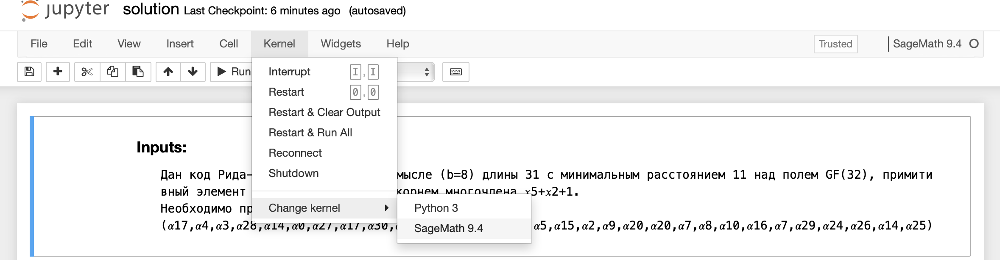

#### Local installation
1. Install Sage library from [here](https://doc.sagemath.org/html/en/installation/binary.html#sec-installation-from-binaries)
<br>[Link](https://github.com/3-manifolds/Sage_macOS/releases/) to MacOS .dmg file
2. Open application and launch it from directory which contains `solution.ipynb` file 
3. Change kernel 
4. Change `b, d, y_coef` variables
   
---

#### Online Sage solver approach
1. Open [online sage solver](https://sagecell.sagemath.org)
2. copy and paste the code below and change `y, b, y_coef` variables
 
```python
# Change this variables
b=8
n=31
d=11
y_coef=[
    17, 4, 3, 28, 14, 0, 27, 17, 30, 3, 29, 0, 26, None, 
    25, 5, 15, 2, 9, 20, 20, 7, 8, 10, 16, 7, 29, 24, 26, 14, 25
]


base = 2 
size = base ^ 5
Field.<a> = GF(size)
PolyRing.<x> = PolynomialRing(Field)
PolyRing

def get_cycle_indices(alpha):
    ind_map = {}
    for i in range(size - 1):
        ind_map[alpha ^ i] = i
    
    res = []
    _all = set()
    for e in Field:
        if e == 0:
            continue
        if e in _all:
            continue
        cur = set()
        while not (e in cur):
            cur.add(e)
            _all.add(e)
            e = e ^ base
        res.append(list(cur))


    all_ind = []
    for l in res:
        inds = []
        for el in l:
            inds.append(ind_map[el] % size)
        inds.sort()
        all_ind.append(inds)
    return all_ind, ind_map

def get_S(y_coef):
    y = 0
    for p in range(len(y_coef)):
        if y_coef[p] != None:
            y = y + x ^ p * alpha ^ y_coef[p] 

    S = 0
    for i in range(b, b + d - 1):
        ff = y(alpha ^ i)
        S = S + x ^ (i - b) * ff
    return S

def get_lmd(S):
    L = 0
    lmd = x ^ 0
    B = x ^ 0
    for r in range(d - 1):
        delta = 0
        for j in range(L + 1):
            delta += lmd[j] * S[r - j]
        B = x * B
        if delta != 0:
            t = lmd - delta * B
            if 2 * L <= r:
                B = delta ^ (-1) * lmd
                L = r + 1 - L
            lmd = t
            
    return lmd

def get_error_positions(lmd, ind_map):
    def pos(root):
        return ind_map[root[0] ^ (-1)]

    poss = []
    for root in lmd.roots():
        poss.append(pos(root))
    return sorted(poss)

def get_degree(lmd, S, ind_map, poss, d, b):
    G = lmd * S % x ^ (d - 1)
    values = []
    for i in range(len(poss)):
        div = 1
        invX = (alpha ^ poss[i]) ^ (-1)
        for j in range(len(poss)):
            if i != j:
                div *= 1 - alpha ^ poss[j] * invX
        st = invX ^ b * G(invX) / div
        values.append(ind_map[st])
    return values

alpha = Field.multiplicative_generator()
_ , ind_map = get_cycle_indices(alpha)

S     = get_S(y_coef)
lmd   = get_lmd(S)

error_pos = get_error_positions(lmd, ind_map)
degree    = get_degree(lmd, S, ind_map, error_pos, d, b)

print('Error positions = ', error_pos)
print('Alpha degree    = ', list(map(lambda x: f'a^{x}', degree)))
```
