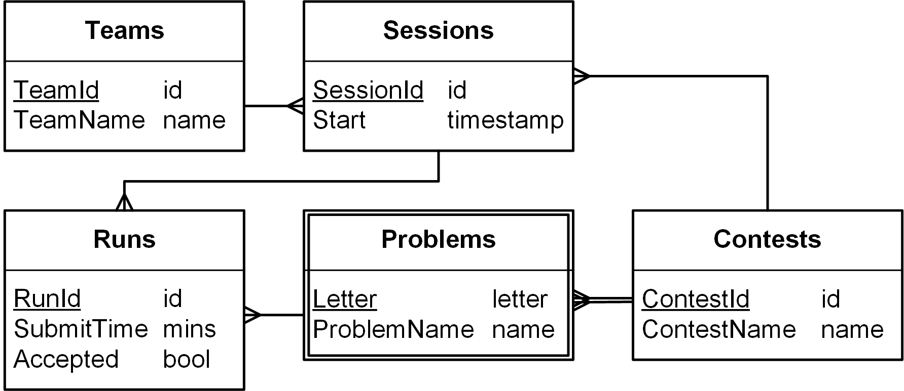

<h1>Контрольная по запросам</h1>
<h2>База данных</h2>

Схема базы данных «Соревнования по программированию».

            В таблице <em>Runs</em>:
        

        <ul>
            <li>
                <em>SubmitTime</em> – целое число минут,
                прошедших с начала соревнования;
            </li>
            <li>
                <em>Accepted</em> – <code>1</code>, если зачтено, 
                иначе <code>0</code>.
            </li>
        </ul>
        

            Примеры исходных данных можно найти в 
            <a href="https://www.kgeorgiy.info/courses/dbms/slides/misc/relations.html">тестовом полигоне</a>.
        

        <h2>Запросы</h2>

        Реализуйте запросы к базе данных 
        «Соревнования по программированию»
    

    <ol>
        <li>
            Запишите следующие запросы в терминах 
            реляционной алгебры и на языке SQL
            <ol>
                <li>
                    Идентификаторы команд, участвующих в соревновании
                    (<em>TeamId</em> по <em>:ContestId</em>).
                </li>
                <li>
                    Названия команд, участвующих в соревновании
                    (<em>TeamName</em> по <em>:ContestId</em>).
                </li>
                <li>
                    Неудачные подходы в соревновании
                    (<em>RunId</em>, <em>SessionId</em>, <em>Letter</em>, <em>SubmitTime</em> по <em>:ContestId</em>).
                </li>
                <li>
                    Команды, не пославшие ни одной задачи в соревновании
                    (<em>TeamName</em> по <em>:ContestId</em>).
                </li>
                <li>
                    Команды, не сделавшие ни одного подхода 
                    хотя бы в одном соревновании
                    (<em>TeamName</em>).
                </li>
                <li>
                    Команды не сделавшие ни одного подхода 
                    хотя бы в одном соревновании, 
                    в котором они участвовали
                    (<em>TeamName</em>).
                </li>
                <li>
                    Сессии, сделавшие подходы
                    по всем задачам в соревновании
                    (<em>SessionId</em>).
                </li>
                <li>
                    Сессии, в которых решены все задачи соревнования
                    (<em>SessionId</em>).
                </li>
                <li>
                    Команды, сделавшие неудачные подходы 
                    по всем задачам хотя бы в одном соревновании
                    (<em>TeamName</em>).
                </li>
                <li>
                    Задачи в которых ошиблись все команды, 
                    участвовавшие в соревновании
                    (<em>ContestId</em>, <em>Letter</em>).
                </li>
            </ol>
        </li>
        <li>
            Запишите следующие запросы 
            на языках Datalog и SQL
            <ol>
                <li>
                    Идентификаторы команд, ошибшихся в задаче
                    (<em>TeamId</em> по <em>:ContestId</em>, <em>:Letter</em>).
                </li>
                <li>
                    Названия команд, не решивших задачу
                    (<em>TeamName</em> по <em>:ContestId</em>, <em>:Letter</em>).
                </li>
                <li>
                    Команды, ошибившиеся хотя бы одной задачи в соревнования
                    (<em>TeamId</em> по <em>:ContestId</em>).
                </li>
                <li>
                    Задачи, решённые всеми сессиями, 
                    участвовашими в соревновании
                    (<em>ContestId</em>, <em>Letter</em>).
                </li>
                <li>
                    Команды, решившие все задачи, 
                    не решённые заданной командой
                    (<em>TeamId</em> по <em>:TeamId</em>).
                </li>
                <li>
                    Задачи которые не решила ни одна команда, 
                    участвовавшая в соревновании
                    (<em>ProblemName</em>).
                </li>
            </ol>
        </li>
        <li>
            Запишите изменяющие запросы на языке SQL
            <ol>
                <li>
                    Удалить все подходы команды
                    (<em>TeamId</em>).
                </li>
                <li>
                    Удалить все подходы соревнования
                    (<em>ContestName</em>).
                </li>
                <li>
                    Для каждой команды, участвовавшей в соревновании
                    добавить новую сессию с текущим временем начала
                    (<em>current_timestamp</em>)
                    (<em>ContestId</em>).
                </li>
                <li>
                    Сделать последний ошибочный подход 
                    в каждой сессии успешным.
                </li>
                <li>
                    Сделать первый подход по каждой задаче
                    в каждой сессии ошибочным.
                </li>
                <li>
                    Для каждой сессии, пытавшейся, но не решившей задачу
                    добавить успешный подход через минуту после последнего
                    подхода по этой задаче.
                    (<em>ContestId</em>).
                </li>
                <li>
                    Для каждой сессии сделать успешный подход 
                    по задаче с нулевым временем. 
                    Если задача уже была решена,
                    то изменить время успешного подхода.
                    [Не проверяется на <em>SQLite</em>.]
                    (<em>ContestId</em>, <em>Letter</em>).
                </li>
            </ol>
        </li>
        <li>
            Запишите агрегирующие запросы на языке SQL
            <ol>
                <li>
                    Для каждой сессии число задач, по которым были подходы
                    (<em>SessionId</em>, <em>Opened</em>).
                </li>
                <li>
                    Для каждой команды число задач, по которым были подходы
                    (<em>TeamId</em>, <em>Opened</em>).
                </li>
                <li>
                    Задачи соревнования, которые решило минимальное число сессий
                    (<em>Letter</em> по <em>:ContestId</em>).
                </li>
                <li>
                    Для каждого соревнования, задачи, 
                    которые решило максимальное число сессий
                    (<em>ContestId</em>, <em>Letter</em>).
                </li>
                <li>
                    Месяцы, в которые создано максимальное число сессий, 
                    решивших хотя бы одну задачу, в формате <em>mm-yyyy</em>.
                    [Не проверяется на <em>SQLite</em>.]
                    (<em>MonthStr</em>).
                </li>
                <li>
                    Для каждого соревнования найти команду,
                    совершившую последний удачный подход
                    (<em>ContestId</em>, <em>TeamName</em>, <em>SubmitTime</em>).
                </li>
                <li>
                    Посчитать число задач, решённых командами.
                    Команды должны быть упорядочены по числу решешенных задач;
                    при равенстве результатов — по убыванию времени начала.
                    (<em>TeamName</em>, <em>Solved</em> по <em>:ContestId</em>).
                </li>
                <li>
                    Посчитать штрафное время, полученное командами.
                    Команды должны быть упорядочены по штрафному времени;
                    при равенстве результатов — по убыванию времени начала.
                    (<em>TeamName</em>, <em>Solved</em>, <em>Penalty</em> по <em>:ContestId</em>).
                </li>
                <li>
                    Построить по соревнованию колонки 
                    «решено задач» и «штрафное время» 
                    Порядок команд должен быть правильным;
                    при равенстве результатов — по убыванию времени начала
                    (<em>TeamName</em>, <em>Solved</em>, <em>Penalty</em> по <em>:ContestId</em>).
                </li>
            </ol>
        </li>
</ol>