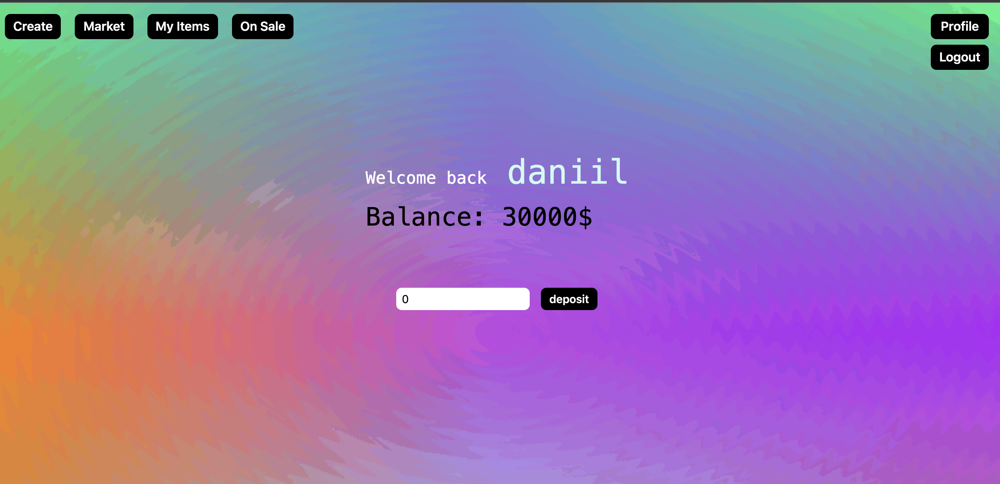

**npm and python versions:**

```shell
npm --version && python --version
6.14.15
Python 3.9.6
```

**Download**

```shell
git clone https://github.com/Danielto1404/digital-art.git
cd digital-art
```

**Run server**

```shell
cd server 
python3 -m venv venv
source venv/bin/activate 
pip install -r requirements.txt 
python server.py
```

**Run frontend**

```shell
cd ../frontend 
npm install
npm start
```

### UI


